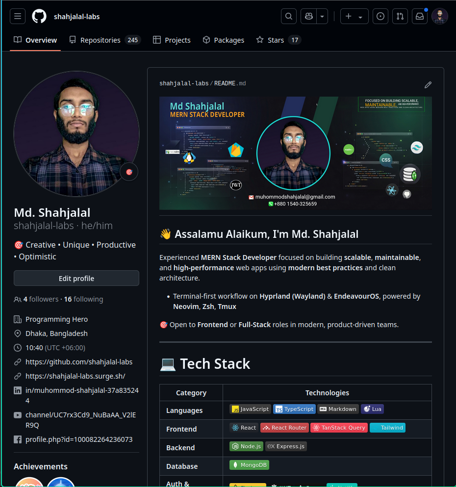
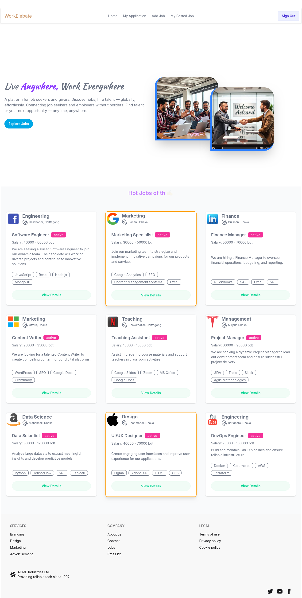
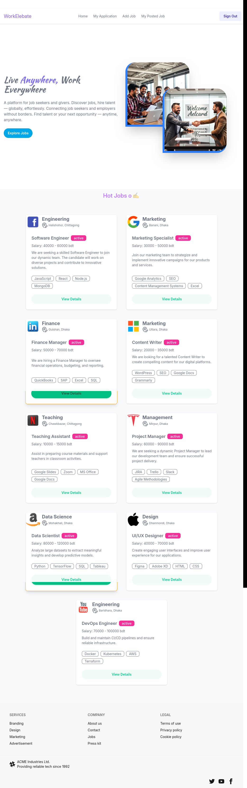
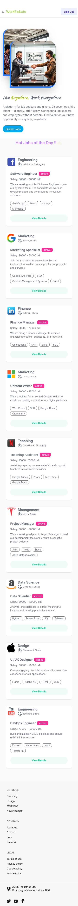

# WorkElebate - Job Portal

[](LICENSE)  
[Live Site](https://gontobbo.surge.sh) | [GitHub Repository](https://github.com/shahjalal-labs/WorkElebate/tree/main/client-WorkElebate)

---

## Table of Contents

- [Project Overview](#project-overview)
- [Features](#features)
- [Project Structure](#project-structure)
- [Routing Architecture](#routing-architecture)
- [Technologies & Dependencies](#technologies--dependencies)
- [Getting Started](#getting-started)
- [Available Scripts](#available-scripts)
- [Contributing](#contributing)
- [License](#license)

---

## Project Overview

WorkElebate is a modern, scalable job portal client application built with React and Vite. It offers a seamless user experience for job seekers and recruiters by integrating authentication, job listings, application management, and recruiter dashboards. The app leverages React Router v7 for routing and Firebase for authentication backend.

---

## Features

- User Authentication: Sign up, sign in, social login, and protected routes
- Job Management: Job listing, details, application submission
- Recruiter Dashboard: Add jobs, view posted jobs, manage applicants
- User Dashboard: View and track personal job applications
- Responsive UI: Built with TailwindCSS, DaisyUI, and custom animations (Lottie)
- State Management & Data Fetching: Uses React Query and Axios for API calls
- Client-side Routing: Protected routes with role-based access control
- Notifications: SweetAlert2 and React Hot Toast for alerts and feedback
- SEO Friendly: React Helmet Async for managing document head

---

## 📂 Project Information

| 📝 **Detail**           | 📌 **Value**                                                                                                     |
| ----------------------- | ---------------------------------------------------------------------------------------------------------------- |
| 💻 **Portfolio GitHub** | [https://github.com/shahjalal-labs/shahjalal-mern](https://github.com/shahjalal-labs/shahjalal-portfolio-v2)     |
| 🌐 **Portfolio Live**   | [http://shahjalal-labs.surge.sh/](http://shahjalal-labs.surge.sh/)                                               |
| 📁 **Directory**        | `/run/media/sj/developer/web/L1B11/11mi/58mo-job-portal/WorkElebate`                                             |
| 👤 **Username**         | `sj`                                                                                                             |
| 📅 **Created On**       | `01/06/2025 07:19 পূর্বাহ্ণ রবি GMT+6`                                                                           |
| 📍 **Location**         | Sharifpur, Gazipur, Dhaka                                                                                        |
| 💼 **LinkedIn**         | [https://www.linkedin.com/in/md-sj-825bb4341/](https://www.linkedin.com/in/md-sj-825bb4341/)                     |
| 📘 **Facebook**         | [https://www.facebook.com/profile.php?id=61556383702555](https://www.facebook.com/profile.php?id=61556383702555) |
| ▶️ **YouTube**          | [https://www.youtube.com/@muhommodshahjalal9811](https://www.youtube.com/@muhommodshahjalal9811)                 |

---

### 📁 Project Structure

```bash
.
├── bun.lock
├── eslint.config.js
├── index.html
├── package.json
├── public
│   └── CNAME
├── src
│   ├── animation
│   │   ├── auth-lottie.json
│   │   ├── index.js
│   │   ├── LottieAnimation.jsx
│   │   └── motion.js
│   ├── App.jsx
│   ├── assets
│   │   └── images
│   │       ├── index.js
│   │       ├── jobseeker1.jpg
│   │       └── jobseeker2.jpg
│   ├── contexts
│   │   └── AuthContext
│   │       ├── AuthContext.jsx
│   │       └── AuthProvider.jsx
│   ├── firebase
│   │   └── firebase.init.js
│   ├── hooks
│   │   ├── useAuth.jsx
│   │   └── useHelmet.jsx
│   ├── index.css
│   ├── main.jsx
│   ├── modules
│   │   ├── Auth
│   │   │   ├── AuthLayout.jsx
│   │   │   ├── components
│   │   │   │   ├── AuthSidebar.jsx
│   │   │   │   ├── constant.js
│   │   │   │   ├── SideBarCard.jsx
│   │   │   │   ├── SigninForm.jsx
│   │   │   │   ├── Signout.jsx
│   │   │   │   ├── SignUpForm.jsx
│   │   │   │   └── SocialLogin.jsx
│   │   │   ├── index.js
│   │   │   └── pages
│   │   │       ├── ForgotPass.jsx
│   │   │       ├── Signin.jsx
│   │   │       └── SignUp.jsx
│   │   ├── jobs
│   │   │   ├── AuthRoute.jsx
│   │   │   ├── components
│   │   │   │   └── Jobcard.jsx
│   │   │   ├── index.js
│   │   │   ├── JobRoute.jsx
│   │   │   └── pages
│   │   │       ├── JobApply.jsx
│   │   │       ├── JobDetails.jsx
│   │   │       ├── Jobs.jsx
│   │   │       └── ThankYou.jsx
│   │   ├── landing
│   │   │   ├── home
│   │   │   │   ├── Banner
│   │   │   │   │   ├── BannerCard.jsx
│   │   │   │   │   ├── BannerImg.jsx
│   │   │   │   │   └── Banner.jsx
│   │   │   │   └── Home.jsx
│   │   │   └── index.js
│   │   ├── myApplication
│   │   │   ├── component
│   │   │   │   ├── ApplicationTableHead.jsx
│   │   │   │   ├── ApplicationTable.jsx
│   │   │   │   └── ApplicationTableRow.jsx
│   │   │   └── pages
│   │   │       └── MyApplication.jsx
│   │   ├── shared
│   │   │   ├── Layout
│   │   │   │   ├── AuthLayout.jsx
│   │   │   │   ├── CommonFooter.jsx
│   │   │   │   ├── index.js
│   │   │   │   ├── NavbarDrawer.jsx
│   │   │   │   ├── Navbar.jsx
│   │   │   │   ├── RootLayout.jsx
│   │   │   │   └── Spinner.jsx
│   │   │   └── ui
│   │   │       ├── Brand.jsx
│   │   │       ├── Button.jsx
│   │   │       ├── index.js
│   │   │       └── Input.jsx
│   │   └── users
│   │       ├── admin
│   │       │   ├── AdminLayout.jsx
│   │       │   ├── components
│   │       │   ├── index.js
│   │       │   └── pages
│   │       ├── recruiter
│   │       │   ├── components
│   │       │   │   ├── AddJobBasicInfo.jsx
│   │       │   │   ├── AddJobFilter.jsx
│   │       │   │   ├── AddJobSelect.jsx
│   │       │   │   ├── Dropdown.jsx
│   │       │   │   ├── PostedJobTableRow.jsx
│   │       │   │   ├── SalaryRange.jsx
│   │       │   │   └── TextArea.jsx
│   │       │   ├── index.js
│   │       │   ├── pages
│   │       │   │   ├── AddJob.jsx
│   │       │   │   ├── ApplicantForPostedJobs.jsx
│   │       │   │   └── MyPostedJobs.jsx
│   │       │   ├── recruiter.constant.js
│   │       │   └── RecruiterLayout.jsx
│   │       └── seeker
│   │           ├── components
│   │           ├── index.js
│   │           ├── pages
│   │           └── SeekerLayout.jsx
│   ├── router
│   │   ├── ProtectedRoute.jsx
│   │   └── router.jsx
│   └── utils
│       ├── axiosInstance.js
│       ├── customAlert.js
│       ├── ErrorMessage.jsx
│       ├── fetchData.js
│       ├── navigate.jsx
│       ├── PageIntro.jsx
│       ├── postData.js
│       └── TypeWriterEffect.jsx
├── structure.md
└── vite.config.js

38 directories, 89 files

```

See full structure in [`structure.md`](structure.md).

---

## Routing Architecture

Routes defined with `createBrowserRouter` (React Router v7), nested layouts, and route protection:

| Path                                | Component                | Protection | Description                      |
| ----------------------------------- | ------------------------ | ---------- | -------------------------------- |
| `/`                                 | `RootLayout` → `App`     | Public     | Home page                        |
| `/jobs/thankyou`                    | `ThankYou`               | Public     | Thank you confirmation page      |
| `/jobs/applyjob/:id`                | `JobApply`               | Protected  | Job application form             |
| `/jobs/:id`                         | `JobDetails`             | Protected  | Job detail view                  |
| `/myApplications`                   | `MyApplication`          | Protected  | User's job applications overview |
| `/recruiter/addjob`                 | `AddJob`                 | Protected  | Recruiter add new job form       |
| `/recruiter/mypostedjob`            | `MyPostedJobs`           | Protected  | Recruiter's posted jobs list     |
| `/recruiter/applicantforpostedjobs` | `ApplicantForPostedJobs` | Protected  | Applicants for recruiter's jobs  |
| `/about`                            | Static div               | Public     | About page (placeholder)         |
| Authentication routes               | `AuthRoute`              | Public     | Authentication related routes    |

---

## Technologies & Dependencies

**Core Libraries**

- React 19.x
- Vite 6.x
- React Router v7
- Firebase Authentication
- TailwindCSS & DaisyUI
- React Query
- Axios
- React Helmet Async
- Lottie React (Animations)
- SweetAlert2, React Hot Toast (Notifications)
- React Hook Form

**Dev Tools**

- ESLint with React hooks plugins
- Vite plugin React
- TypeScript typings for React

---

## Getting Started

### Prerequisites

- Node.js (>= 18.x recommended)
- npm or yarn

### Installation

```bash
git clone https://github.com/shahjalal-labs/WorkElebate.git
cd WorkElebate/client-WorkElebate
npm install
# or
yarn install

```

### Configuration

Update Firebase credentials in: `src/firebase/firebase.init.js`

Running Locally: `npm run dev` or `yarn dev`

Open your browser at http://localhost:5173.

#### Build for Production

`npm run build` or `yarn build`

### Available Scripts

`Command Description
npm run dev Start development server
npm run build Build production assets
npm run preview Preview production build
npm run lint Run ESLint linter`

---

## Contributing

## Contributions are always welcome!

## License

## [MIT](LICENSE)

### Developer info:



### Preview:

##### `Desktop:`



##### `Laptop:`



##### `Mobile:`


